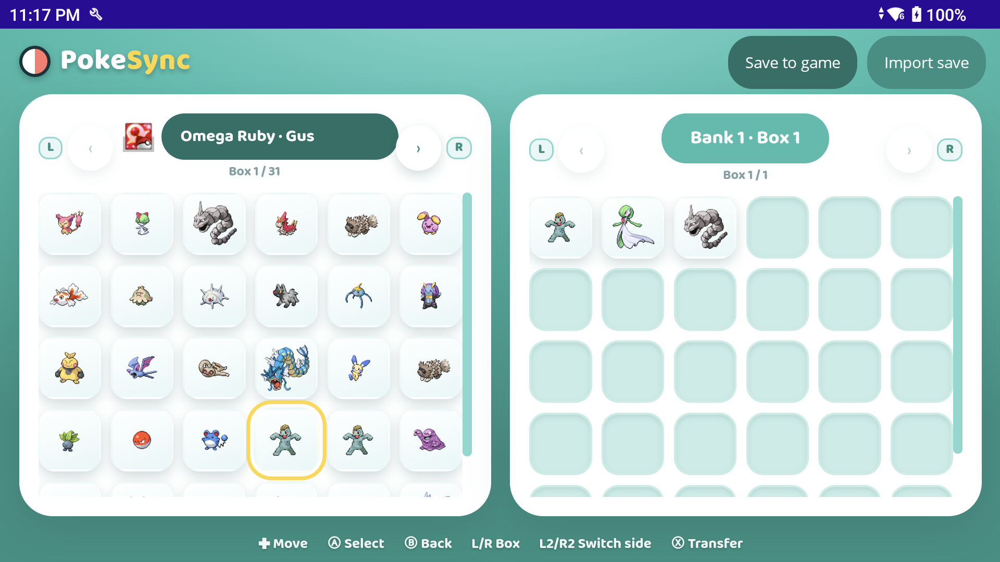
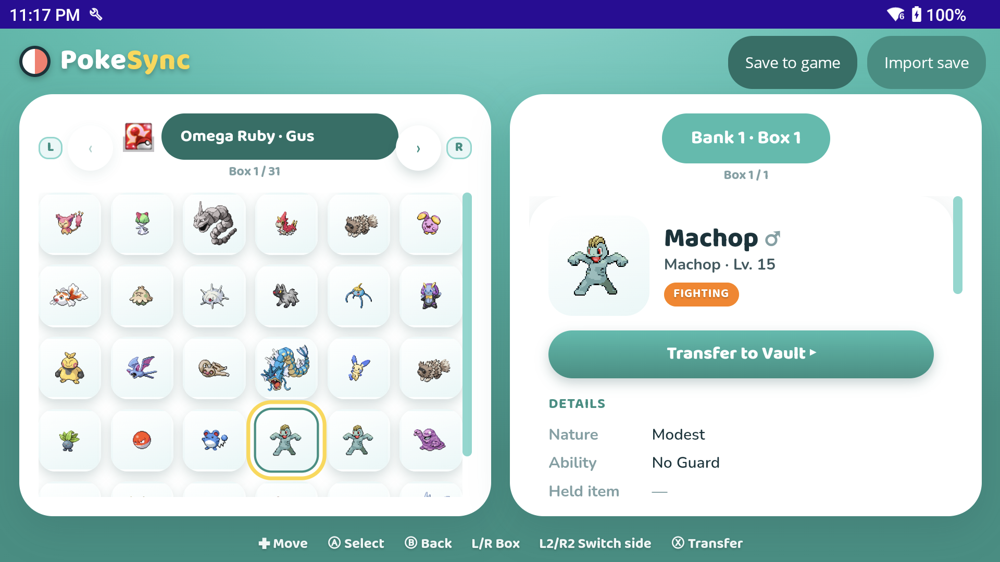

# PokeSync

A **local, offline Pokémon storage app for Android** — a Pokémon HOME-style vault that reads and
writes your emulator save files directly on-device. No server, no account, no cloud.

It pairs a polished mobile UI with the full power of **PKHeX.Core** (Gen 1–9 save parsing, legality,
cross-generation transfer), all running in-process on your phone.

> Rebuilt from the ground up as a self-contained .NET MAUI app. (The previous Kotlin client + hosted
> server are retired — see git history.)

## Screenshots

| Storage (save ⇄ vault) | Enriched summary + transfer |
|---|---|
|  |  |

## What it does

- **Auto-detects** your emulator saves (Eden/Switch, RetroArch, Azahar/3DS, MelonDS/DS, DraStic, …)
  from their live directories, and reads/writes them **in place** so changes round-trip to the game.
- **Dual-pane HOME-style UI** — your save's boxes ⇄ your PKVault vault — with an enriched Pokémon
  summary (types, tera, held item, ball, ability, OT/ID, origin, stats, IVs/EVs, moves, ribbons).
- **Transfer** Pokémon between saves and the vault, with legality/compatibility checks.
- **Controller + touch** navigation (D-pad cursor, A/B, L/R boxes), tuned for handhelds.
- Manual **import** of any save via the Android file picker (with write-back), as a fallback.

## Architecture

A single MAUI Android app hosts everything in one process:

```
┌ MAUI app (app/) ──────────────────────────────────────────────┐
│  WebView  ──HTTP──▶  in-process Kestrel (127.0.0.1)            │
│                        └ PKVault backend (backend/)           │
│  React UI (frontend/) ◀── served by the backend               │
│                          • PKHeX.Core (pkhex/ submodule)      │
│                          • EF Core + SQLite (on-device)       │
│  Native: All-Files-Access, emulator scan, SAF import          │
└────────────────────────────────────────────────────────────────┘
```

| Folder | What |
|---|---|
| `app/` | .NET MAUI shell (WebView host, emulator scan, file access) — `net10.0-android` |
| `backend/PKVault.Backend/` | Embedded ASP.NET backend (PKHeX logic, storage, REST API) — a fork of [PKVault](https://github.com/Chnapy/PKVault), de-webbed + auth stripped for local single-user |
| `frontend/` | The PokeSync React UI (Vite). See `frontend/src/pokesync/README.md` |
| `pkhex/` | **git submodule** → [kwsch/PKHeX](https://github.com/kwsch/PKHeX) (PKHeX.Core) |

## Build & run

Prereqs: .NET 10 SDK + `maui-android` workload, Android SDK, JDK, **Node 22** (for the frontend).

```bash
git clone --recurse-submodules git@github.com:gustavoarechigajr/PokeSync-Android.git
cd PokeSync-Android
# (if you forgot --recurse-submodules)  git submodule update --init

# 1) build the frontend (Node 22) and embed it into the backend
cd frontend && npm install && npm run build
rm -rf ../backend/PKVault.Backend/wwwroot && cp -r dist ../backend/PKVault.Backend/wwwroot
cd ..

# 2) build + deploy the app to a connected device
dotnet build app/PKHeX.Android.csproj -t:Run -f net10.0-android -c Debug -p:AdbTarget="-s <serial>"
```

On first launch, grant **All files access** so PokeSync can read/write your emulator saves.

### Regenerating the API SDK

`frontend/src/data/sdk/` (committed) is generated by Orval from the backend's OpenAPI doc. To
regenerate after backend API changes, run the backend with Swagger enabled and re-run Orval — see
`frontend/src/pokesync/README.md`.

## License

`backend/` derives from PKVault (GPLv3); `pkhex/` is PKHeX (GPLv3). This project is GPLv3.
